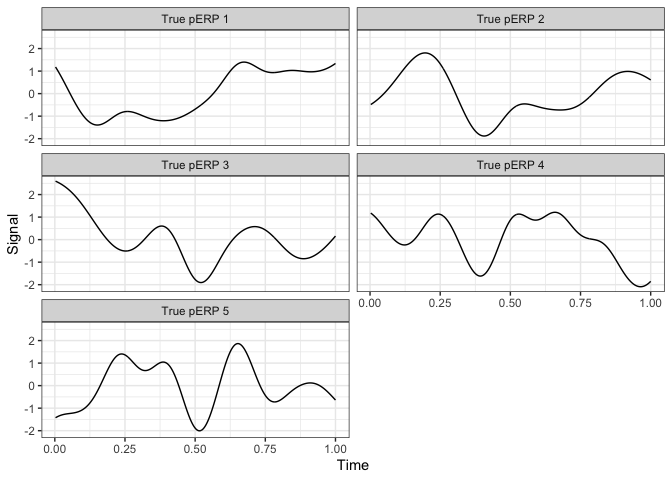
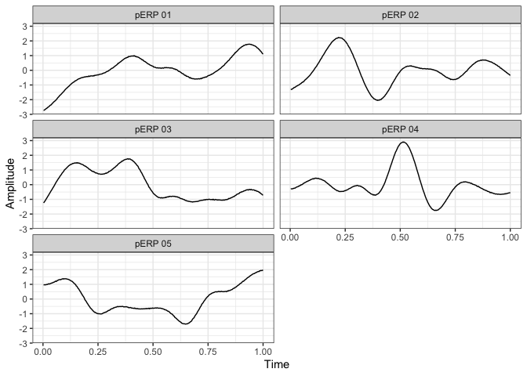
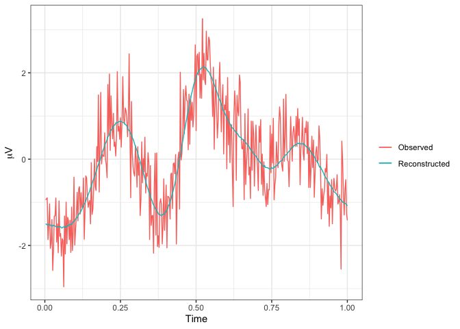
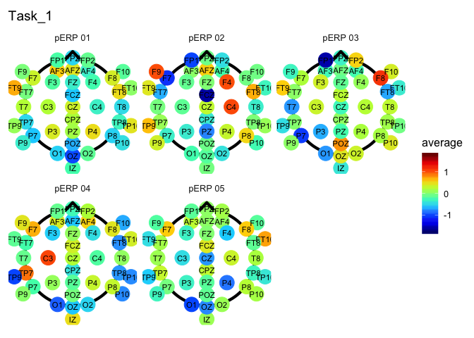
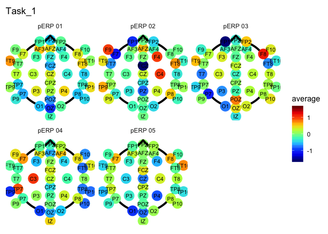

<!-- README.md is generated from README.Rmd. Please edit that file -->

# pERPred

<!-- badges: start -->

<!-- badges: end -->


The `pERPred` package is a tool for conducting ERP analyses using the
Principle ERP Reduction algorithm put forth in (cite our paper) by
Campos and Hazlett et al (2019). This package contains the functions
necessary to derive the principle ERPs discussed in that publication as
well as the tools for performing “pERP-space analysis”. Let this serve
as a guide to our approach to ERP analysis in `R`.

## Installation

You can install the released version of pERPred from
[CRAN](https://CRAN.R-project.org) with:

``` r
install.packages("pERPred")
```

And the development version from [GitHub](https://github.com/) with:

``` r
# install.packages("devtools")
devtools::install_github("emjcampos/pERPred")
```

## Example

### Simulated Data Description

The generation model for the simulated data is described in the
publication as follows. The observed signal is assumed to be a linear
combination of the principal ERP components (pERPs). Let
\(Y_{i,v,e}(t)\) denote the ERP signal observed for subject \(i\) at
task \(v\) and electrode \(e\). The data generation model in the
simulation will be: 

In the simulation, \(N = 100\), \(V = 9\), \(C = 5\), \(T = 384\), and
each subject has a common \(E = 40\). The first term reflects that each
task and electrode is composed of a weighted average of pERPs, where
\(\phi^{\star}_c(t)\) are the \`\`true’’ pERPs for purposes of
simulation. To simulate a single \(\phi^{\star}_c(t)\), we draw a
function that is a superposition of Gaussian kernels centered at
different time points to produce a smooth, low-frequency function
intended to mimic the type of source signals we would expect to
contribute to ERP waveforms. These simulated signals are then rotated by
ICA to form maximally independent bases and are plotted
here.



The coefficients, \(k_{c,v,e}\), are drawn from a normal distribution
with mean zero and variance \(\sigma^2_{k}=0.25\).

The second term reflects the structured stochastic canonical component
with dependencies within a subject across tasks and electrodes. The
subject specific scores \(\xi_{c,i,v,e}\) will be simulated from a
Matrix Normal (to create a depedence structure within tasks and across
electrodes) with mean zero and covariance matrices \(\Sigma_{c,v}\) and
\(\Sigma_{c,e}\) of dimension \(V\ast V\) and \(E\ast E\) (identically
and independently drawn over subjects only). The covariance matrices are
created in the same way for the electrode and task dimensions. A matrix
with 0.5 on the diagonal and 0.1 elsewhere created. Each of these is
multiplied by a factor (0.1, 0.2, 0.3, 0.4, 0.5), so that each true ERP
component is represented differently. In the results, we expect the
component with the highest multiplier to explain the most variation in
the observed signals.

The last term is the independent and identically distributed (iid)
measurement error. The measurement error \(\zeta_{i,v,e}(t)\) will be
simulated as independent draws (over \(i\), \(v\), and \(e\)) from a
normal distribution with mean zero and variance
\(\sigma_\text{error}^2\) equal to some proportion of the signal
variance. Define the variance of the simulated signal terms
\(\sum_{c=1}^C k_{c,v,e}\phi^{\star}_c(t) + \sum_{c=1}^C \xi_{c,i,v,e}\phi^{\star}_c(t)\)
to be \(\sigma_\text{signal}^2\). For the purposes of this vignette, we
will only explore the low noise case in which 1/3 of the simulated ERP
will be noise so
\(\sigma^2_\text{error} = \sqrt{0.5}\times\sigma_\text{signal}\).

The data to be used in the `pERPred` function must be averaged over
trials. Then there must be one column for the “Task”, “Subject”, and
“Time”, and the remaining columns are the named electrodes that were
observed. All subjects must have the same number of time points observed
as well as the same number of tasks. However, there may be a different
number of electrodes (use NA for the missing electrodes). For example,
our simulated data looks like this:

``` r
head(simulated_data[, 1:7])
#> # A tibble: 6 x 7
#>   Task   Subject        Time     AF3    AF4    AFZ     C3
#>   <chr>  <chr>         <dbl>   <dbl>  <dbl>  <dbl>  <dbl>
#> 1 Task_1 Subject_001 0.00260 -0.832  1.66   -1.46  -1.22 
#> 2 Task_1 Subject_001 0.00521  0.903  1.15   -2.37  -3.45 
#> 3 Task_1 Subject_001 0.00781 -0.0771 0.522  -0.862 -0.645
#> 4 Task_1 Subject_001 0.0104  -0.227  0.0655 -2.82  -3.68 
#> 5 Task_1 Subject_001 0.0130  -1.14   1.30   -1.11  -1.56 
#> 6 Task_1 Subject_001 0.0156  -1.82   0.765  -0.929 -2.60
```

### pERP-RED

Begin by loading the `pERPred` package.

``` r
library(pERPred)
```

Now using the `pERPred` function, you can estimate the pERPs. There are
two choices that are chosen by the user:  
1\. the number of pERPs to estimate; and  
2\. the proportion of variation each of the PCA steps must explain.

By default, the percent of variation is set to 80. Raising this value
means more components will be kept in each of the PCA steps and the
computation time will rise accordingly. Also, the number of pERPs is
chosen based on an \(R^2\) value defined as:  and can be calculated
using the `R2_test` function.

When estimating the pERPs, split the data into a training and test set,
then calculate the \(R^2_{test}\). After the number of pERPs is chosen,
you can re-estimate the pERPs using the whole dataset. If preferred, it
is possible to parallelize the estimation to speed up this process using
the `future` package (see commented code).

``` r
subject_list <- unique(simulated_data$Subject)
electrode_list <- names(simulated_data)[-c(1:3)]
task_list <- unique(simulated_data$Task)
train_subjects <- 
  sort(sample(subject_list, round(2 * length(subject_list) / 3)))

pERPs <- map(3:7, 
             ~ pERPred(simulated_data[simulated_data$Subject %in%
                                        train_subjects, ],
                       num_pERPs = .x,
                       percent_variation = 80))

# library(future)
# plan(multiprocess) 
# pERPs <- future_map(3:7, 
#                     ~ pERPred(simulated_data[simulated_data$Subject %in% 
#                                                train_subjects, ], 
#                               num_pERPs = .x, 
#                               percent_variation = 80), 
#                     .progress = TRUE)
```

Based on the \(R^2_{test}\) values, we would choose 5 as the appropriate
number of pERPs since it is the point at which the \(R^2_{test}\) tapers
off.

``` r
map_dfr(pERPs, ~R2_test(simulated_data, .x)) 
```

    #> # A tibble: 5 x 2
    #>      R2 pERPs
    #>   <dbl> <int>
    #> 1 0.468     3
    #> 2 0.575     4
    #> 3 0.671     5
    #> 4 0.672     6
    #> 5 0.673     7

``` r
pERPs5 <- pERPred(simulated_data,
                 num_pERPs = 5,
                 percent_variation = 80)
```

``` r
pERPs5 %>%
  mutate(Time = unique(simulated_data$Time)) %>%
  gather(pERP, Amplitude, -Time) %>%
  ggplot() +
  geom_line(aes(x = Time, y = Amplitude)) +
  facet_wrap(~ pERP, ncol = 2)
```



### pERP-space Analysis

There are many analyses we can perform using these pERPs. In the paper,
we discuss a few. First, we want to compute the weights \(\omega_j\) for
each record using the `pERP_scorer` function.

``` r
individual_scores <- pERP_scorer(simulated_data, pERPs5)
```

``` r
head(individual_scores)
#> # A tibble: 6 x 8
#>   Task   Subject     Electrode term   estimate std.error statistic  p.value
#>   <chr>  <chr>       <chr>     <chr>     <dbl>     <dbl>     <dbl>    <dbl>
#> 1 Task_1 Subject_001 AF3       pERP …   0.562     0.0456    12.3   1.64e-29
#> 2 Task_1 Subject_001 AF3       pERP …  -0.153     0.0456    -3.35  8.83e- 4
#> 3 Task_1 Subject_001 AF3       pERP …  -0.383     0.0456    -8.38  1.02e-15
#> 4 Task_1 Subject_001 AF3       pERP …   0.682     0.0456    15.0   4.69e-40
#> 5 Task_1 Subject_001 AF3       pERP …   0.734     0.0456    16.1   9.10e-45
#> 6 Task_1 Subject_001 AF4       pERP …   0.0114    0.0480     0.238 8.12e- 1
```

Now we can reconstruct each record using their weights and the pERPs.
Here is an example using subject 1, electrode CZ, task 1.

``` r
record <- simulated_data %>% 
  filter(Subject == "Subject_001", 
         Task == "Task_1") %>% 
  select(Task, Time, "CZ")
scores <- individual_scores %>% 
  filter(Subject == "Subject_001", 
         Electrode == "CZ", 
         Task == "Task_1") %>% 
  pull(estimate)
projected <- data.frame("Projected" = as.matrix(pERPs5) %*% 
                          as.matrix(scores)) %>% 
  as.data.frame() %>% 
  mutate(Time = record$Time) %>% 
  mutate(Projected = Projected + mean(record$CZ))

ggplot() + 
  geom_line(data = record, 
            aes(x = Time, y = CZ, color = "Observed")) + 
  geom_line(data = projected, 
            aes(x = Time, y = Projected, color = "Reconstructed")) +
  theme(legend.title = element_blank()) + 
  labs(y = TeX("$\\mu V$"))
```



Keeping in mind that this is simulated data, we can visualize how these
weights are represented across the scalp for all subjects using the
`coefficient_headmap` function. Create a dataframe of the average scores
where the column of averages is named `average`. Split the dataframe by
Task to create a list of dataframes. This will allow the scale to remain
the same over all tasks. If you want the scale to stay the same over
only selected Tasks, only include those tasks in the list of dataframes.

``` r
average_scores <- individual_scores %>% 
  group_by(Task, Electrode, term) %>% 
  summarise(average = mean(estimate, na.rm = TRUE)) %>% 
  split(.$Task)

# keep scale the same across all tasks
coefficient_headmap("Task_1", average_scores)
```



``` r

# keep scale the same across only tasks 1 and 2
coefficient_headmap("Task_1", average_scores[c("Task_1", "Task_2")])
```


